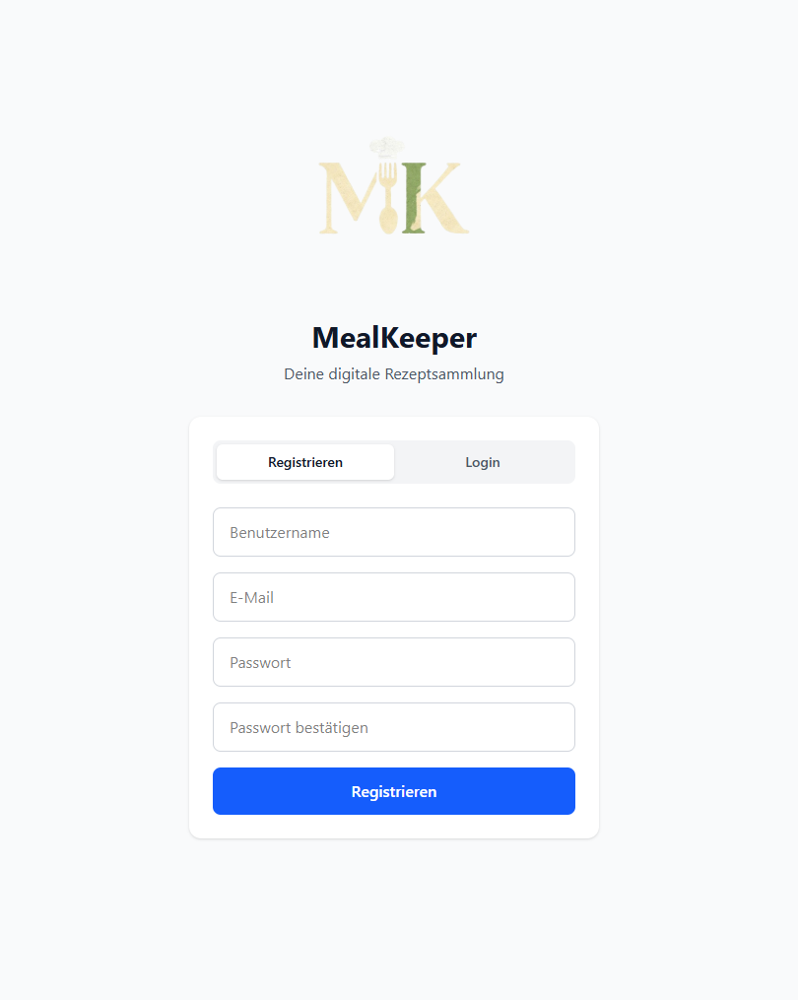

# MealKeeper – Modern Recipe Manager

MealKeeper is a modern, user-friendly recipe manager built with Vue.js 3, Pinia, Supabase, and Tailwind CSS. Easily collect, organize, and scale your favorite recipes. Features include cloud authentication, dynamic ingredient scaling, image upload, and mobile-optimized design.

## Features

- **User Authentication**  
  Secure registration and login with Supabase Auth.

- **Recipe CRUD**  
  Create, view, update, and delete recipes stored in a Postgres database.

- **Dynamic Ingredients & Steps**  
  Add, remove, and reorder ingredients and preparation steps with drag & drop support.

- **Portion Scaling**  
  Instantly scale ingredient quantities based on servings.

- **Image Upload**  
  Upload and preview recipe images, stored with public URLs.

- **Search & Filter**  
  Case-insensitive recipe search by title with instant feedback.

- **Responsive, Clean Design**  
  Fully responsive layouts styled with Tailwind CSS inspired by mobile UI best-practices.

## Planned Features

- **Google Sign-In for easier authentication**
- **Integrated shopping list functionality**

## Tech Stack

- [Vue.js 3](https://vuejs.org/)
- [Vite](https://vitejs.dev/)
- [Pinia (State Management)](https://pinia.vuejs.org/)
- [Supabase (DB, Auth, Storage)](https://supabase.com/)
- [Tailwind CSS v4](https://tailwindcss.com/)

## Getting Started

### Prerequisites

- Node.js (v18+ recommended)
- Supabase account and project

### Setup

1. **Clone the repo**

- git clone https://github.com/YOUR_USERNAME/mealkeeper.git
- cd mealkeeper

2. **Install dependencies**

- npm install

3. **Configure Supabase**

- Copy `.env.example` to `.env.local`
- Add your Supabase URL and anon key to the env file

4. **Run the development server**

- npm run dev

### Supabase database setup

- `recipes` (main table: id, title, portions, image_url, ...)
- `recipe_ingredients` (linked to recipe_id)
- `recipe_steps` (linked to recipe_id)

### Features in action

| Feature         | Screenshot                           |
| --------------- | ------------------------------------ |
| Authentication  |                |
| Add/Edit Recipe |                |
| Recipe Overview |  |
| Recipe Detail   |  |

## Contributing

Contributions and suggestions are welcome! Open an issue or submit a pull request.

## License

[MIT](LICENSE)

---

**Developed with love by Björn**
